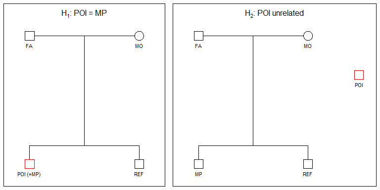
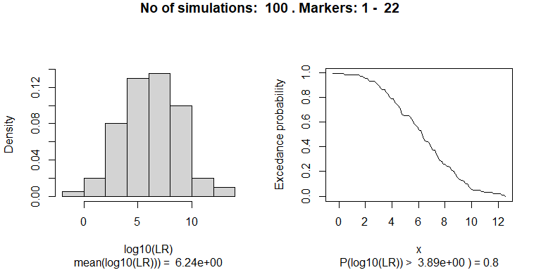
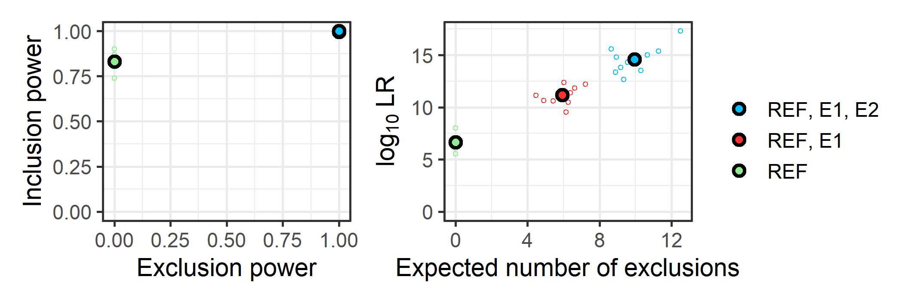
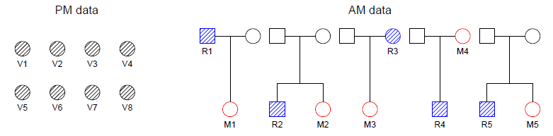
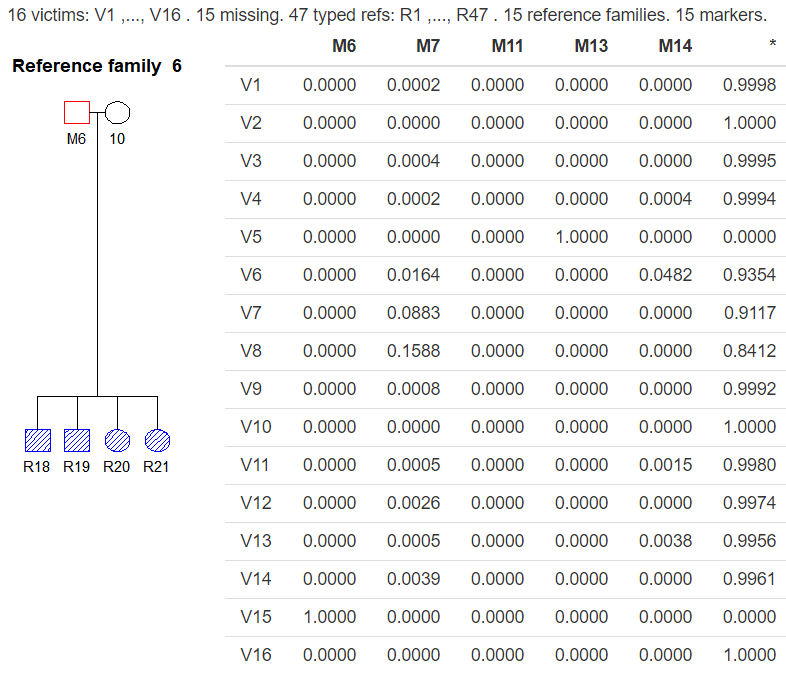
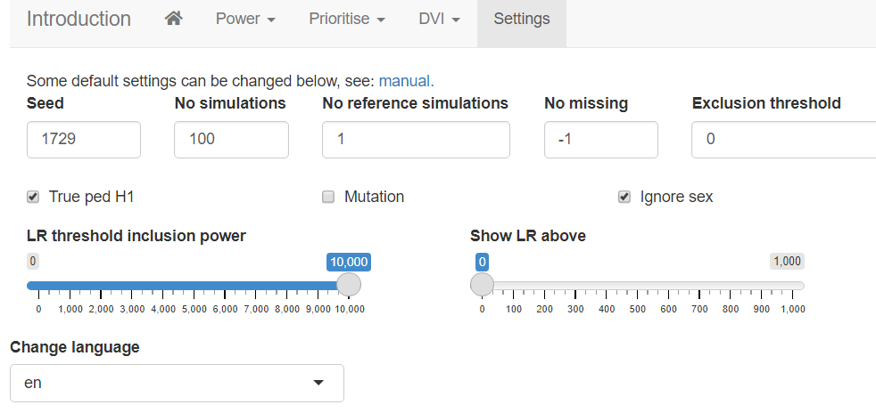

Disaster Victim Identification app: dviapp
================
21 oktober 2022

This note documents the functionality of the `dviapp`. The app deals
with Disaster Victim Identification (DVI) problems and power calculation
for kinship problems. Our goal has been to make available functionality
in the [`pedsuite`](https://magnusdv.github.io/pedsuite/) of R libraries
and also the `dvir` library. Compared to
[`Familias`](https://thoree.shinyapps.io/dviapp/), the app provides
several extensions including more general conditional simulations,
exclusion calculations and the ability to handle multiple missing
persons in a family.

Here’s the dviapp: <https://thoree.shinyapps.io/dviapp/>

There are several built-in-cases. Alternatively, users can run run their
own examples by uploading [Familias](https://www.familias.no) files or
data on R format.

There are tree modules:

- Power: Simulations can be done to determine if the statistical
  evidence is sufficient.
- Priority: The aim is to find the optimal extra persons to genotype in
  cases with insufficient data.
- DVI: Methods to include or exclude missing persons are provided.

These modules are explained and exemplified below. For more information,
please check the books [Mass
identications](https://www.elsevier.com/books/mass-identifications/kling/978-0-12-818423-3)
(Kling et al., 2021), [Pedigree Analysis in
R](https://www.elsevier.com/books/pedigree-analysis-in-r/vigeland/978-0-12-824430-2)
(Vigeland, 2021), or the [dvir
paper](https://www.nature.com/articles/s41598-021-93071-5) (Vigeland and
Egeland, 2021). For further documentation and bug reporting, please go
[here](https://github.com/thoree/dviapp).

Mutations are switched off in the examples below if not stated
otherwise. However, mutation can be turned on in `Settings` and other
options can be changed there as well.

## Power

Power calculations are generally performed prior to the actual analysis
to determine if there is sufficient data to reach conclusions. The
conclusion from a power analysis may be that there is sufficient
information *or* that we are not likely to reach reliable conclusions.
In the latter case more data is needed, either more markers or more
genotyped reference individuals. This is explored in the `Prioritise`
module.

We consider two hypotheses

- $H_1$: The Person Of Interest (POI) is the Missing Person (MP).
- $H_2$: POI is unrelated to MP.

The hypotheses are illustrated below.

Marker data are simulated a specified number times for POI and the
references (in the figure above there is only one reference). The
default number of simulations is 100 and should be increased to 1000 in
final applications. The simulations are done conditionally on genotyped
individuals, above there are none. These simulations are done assuming
$H_1$ to be true, i.e., assuming that POI is MP. For each of these
simulations the LR is calculated. This gives values
$\text{LR}_1, \ldots, \text{LR}_{100}$ and based on these values, the
app produces the plot in Figure 2 below.

The left panel shows that the mean $\log_{10}$() is 6.24. Recall that if
$\log_{10}$() = 6\$, say,then LR = $10^6=1,000,000$. From the panel on
the right hand side, we see that $\log_{10}$() exceeds 3.89 with
probability 0.8, or equivalently LR exceeds 7762 with probability 0.8.
If the requirement is that LR should exceed 10,000 with a probability of
at least 0.8, the power is not quite satisfactory.

### Analyses based on built-in-cases

For the built-in part, 35 markers from the `NorwegianFrequency` database
(documented in the R library `forrel`) are used. Above, the 22 first
markers have been selected. If the number of markers is increased to 25
in the above example, the threshold of 10,000 is met.

Greater accuracy, at the cost of increased computational time, is
obtained by increasing the number of simulations in `Settings`. To
obtain the same sequence of simulations, and the same result for
repeated calculations, the `Seed` in `Settings` need to be set to same
value.

### Analyses based on user loaded data

The analyses in this window is the same as explained above. The
difference is that the data is now loaded from a Familias file. The file
is created on before hand in the main module of Familias, not the DVI
module of Familias. The missing person need to be named `MP` and the
reference `REF`. These individuals are not genotyped. There may be
genotyped individuals. If so, these will be conditioned on in the
simulation. The genotyped individuals will be hatched in the plot and
the first marker is displayed.

## Prioritise

The typical scenario for this functionality is as follows: A power
calculation has been performed. The conclusion is that more individuals
need to be genotyped in the hope of reaching sufficient power. We
consider alternatives where additional family members `E1` and `E2` of
the reference family are available. Results are reported when `E1` is
genotyped and both `E1` and `E2`. In addition to the LR distribution
described previously, results are also given for the `Exclusion power`
(EP) explained below.

Consider first the panel on the left hand side. The Y-axis gives the
inclusion power (IP) defined as the probability that LR exceeds 10,000
given $H_1$, i.e., `MP = POI` is true. If only the member `REF` of the
the reference family is genotyped, IP is close to 0.8. In this case, ten
profiles for `REF`, `E1` and `E2` have been simulated. In the app, this
number is specified in `Settings > No of reference simulations`. For
each of these profiles, 100 simulations are performed for `MP` under
$H_1$ and $H_2$. The smaller circles in the plot correspond to these 10
profile simulations while the larger circles represent averages. For
both other alternatives, (`REF`, `E1`), and (`REF`, `E1, E2`), IP is
very close to 1.

The Y-axis in the panel to the right, shows that the alternative
(`REF`,`E1, E2`) can be expected to give the largest LR. The X-axes give
information on `EP`. The baseline alternative, with only `REF`
genotyped, gives the value 0 in both plots. This is obvious, since
exclusion is not possible if only one brother is genotyped as two
brothers need not share alleles. If there are more than two brothers,
exclusion is indicated if more than four alleles are observed. Mutations
are disregarded for exclusion calculations. If additional brothers are
genotyped, exclusion is probable and also likely as evidenced by EP in
the plot to the left and by the expected number of exclusions to the
right. The plot to the right is more informative as it shows that more
exclusions can be expected when more brothers are typed.

As for the `Power` module, simulations can be done either for
built-in-cases or by loading a Familias file.

## DVI

Also in this module, analyses can be done from built-in-cases or from
Familias files. In addition R-data can be loaded provided they are on
the same format as the examples in the `dvir` library. The below figure
shows the `planecrash` data.

There are 8 female victims to left, hatched since they are genotyped. To
the right there are five reference families, each having one missing
person and one reference family member. In the following sections, we
explain possible analyses based on the `planecrash` data to exemplify.

For analyses involving AM data based on Familias files, relabeling of
the names of the missing persons is required, i.e., the user needs to
tick `Relabel`. The reason is that all missing persons by default have
the same name in the fam file. After relabelling, victims are named
`V1`, `V2`, … . Missing persons are named `M1`, `M2`, … and families
`F1`, `F2`, ….

### IBD estimates

This part deals with identical by descent (IBD) coefficients quantifying
relatedness. The distinction between alleles identical by descent (IBD)
and alleles identical by state (IBS) is essential. IBD alleles originate
from the same ancestral allele within a given pedigree, while IBS
alleles only have the same appearance, but they need not come from the
same ancestor. Unrelated individuals may share IBS alleles, but not IBD
alleles.

The relationship between a pair of non-inbred individuals can be
described in more detail by Z, the number of IBD alleles shared by two
individuals. We define the IBD coefficients $$
\kappa_0=P(Z=0),{\ \kappa}_1=P(Z=1),\ \text{and} \ \kappa_2=P(Z=2).
$$ The corresponding estimates are denoted k0, k1 and k2. The pairwise
relationship between all pairs of victims is estimated and compared to
unrelated. Here’s an example:

    ##    id1 id2  N        k0         k1        k2           LR
    ## 28  V7  V8 15 0.1401716 0.56471243 0.2951160 7.375616e+05
    ## 12  V2  V7 15 0.5171441 0.36534023 0.1175156 4.425561e+01
    ## 19  V4  V5 15 0.7892599 0.01978912 0.1909510 1.307272e+01
    ## 7   V1  V8 15 0.5214316 0.47856843 0.0000000 1.246938e+01
    ## 14  V3  V4 15 0.6412325 0.35876747 0.0000000 8.847521e+00

There are $7\cdot 8/2 = 28$ pairwise comparisons that can be made
between the 8 victims. Above, five are listed, sorted according to
decreasing LR. The parameters describing the pairwise relationship are
estimated as (k0 = 0.14, k1 = 0.56, k2 = 0.30) in the first line. This
is quite far from the parameters describing unrelated individuals, (0,
1, 0). The LR tests the estimated relationship against the specified,
unrelated in this case. In this case, $\text{LR}= 737562$, and this
provides strong evidence in favor of V7 and V8 being related.

### Exclusion

Each victim is tried in each missing person position and the number of
exclusions are counted. The results are summarised in the
`exclusion matrix` below:

    ##    M1 M2 M3 M4 M5
    ## V1  0  0  8  9  0
    ## V2  4  0  0  7  0
    ## V3  7  0  8  1  0
    ## V4  3  0  6  6  0
    ## V5  2  0  6 10  0
    ## V6  5  0  3  5  0
    ## V7  7  0  2  7  0
    ## V8  6  0  6  6  0

We see that families 2 and 5, with missing persons M2 and M5, do not
allow for exclusions as only one sibling has been genotyped. The
corresponding columns therefore only contain 0-s. Furthermore, we see
that the only likely candidate for M1 is V1, since for the other victims
there are at least two exclusions.

### Pairwise LR

For each victim V and each missing person M, the LR comparing `V = M` to
`V and M unrelated`, is calculated. Here’s an example :

    ##              M1           M2           M3           M4           M5
    ## V1 9.248816e+02 9.411564e-04 1.258106e-22 2.750399e-26 2.853849e-01
    ## V2 1.500072e-10 6.928184e-02 6.739736e+04 2.332834e-19 6.864631e-02
    ## V3 2.698238e-20 1.073578e-04 6.307786e-23 2.493147e+02 3.983652e-03
    ## V4 9.962125e-07 3.957145e-05 2.162647e-15 1.141707e-15 3.169369e+07
    ## V5 9.090162e-02 9.994029e-04 3.844531e-17 3.649795e-29 4.065066e-03
    ## V6 9.507818e-14 1.069007e+06 1.012061e-07 1.273562e-14 1.356608e-05
    ## V7 9.168642e-19 6.155248e-04 4.982251e+00 4.512892e-20 1.959095e-01
    ## V8 4.634759e-16 1.998729e-04 3.193541e-14 1.773908e-16 2.801497e-01

A mutation model has been defined (the proportional model with rate =
0.001) and so all likelihood ratios are positive. We see that the only
candidate for the missing person M1 is V1, the LR is 925, all other LR-s
are close to 0. If mutations are removed, we get

    ##          M1           M2       M3 M4           M5
    ## V1 928.6003 9.033557e-04     0.00  0 2.772464e-01
    ## V2   0.0000 6.745912e-02 67917.21  0 6.663941e-02
    ## V3   0.0000 1.030688e-04     0.00  0 3.820204e-03
    ## V4   0.0000 3.779779e-05     0.00  0 3.189844e+07
    ## V5   0.0000 9.623366e-04     0.00  0 3.921652e-03
    ## V6   0.0000 1.079809e+06     0.00  0 1.293453e-05
    ## V7   0.0000 5.901476e-04     0.00  0 1.904472e-01
    ## V8   0.0000 1.910791e-04     0.00  0 2.722293e-01

### Joint

All possible assignments of victims to missing persons, are evaluated
and solutions are ranked according to the likelihood ratio. Here’s an
example

    ##   V1 V2 V3 V4 V5 V6 V7 V8    loglik           LR   posterior
    ## 1 M1 M3  * M5  * M2  *  * -562.8019 2.172326e+21 0.998924269
    ## 2  * M3  * M5  * M2  *  * -569.6356 2.339356e+18 0.001075731

The best solution is the assignment where V1 = M1, V2 = M3, V4 = M5 and
V6 = V2. The remaining victims, V3, V5, V7 and V8 are not identified.
This optimal solution has an LR of $2.2\cdot 10^{21}$ compared to the
assignment where no victims are identified. The rightmost column gives
the posterior probability. It can be shown that there are 19081 apriori
possible assignments, i.e., there are 19081 possible ways of identifying
victims and missing persons when data is not taken into account. Each of
these assignments are given a prior probability of 1/19081. The
posterior is then calculated using Bayes Theorem.

If mutations are modelled, the five best candidate assignments are

    ##   V1 V2 V3 V4 V5 V6 V7 V8    loglik           LR    posterior
    ## 1 M1 M3 M4 M5  * M2  *  * -557.3114 5.265386e+23 9.947433e-01
    ## 2 M1 M3  * M5  * M2  *  * -562.8301 2.111943e+21 3.989910e-03
    ## 3  * M3 M4 M5  * M2  *  * -564.1411 5.693038e+20 1.075536e-03
    ## 4  * M3 M4 M5 M1 M2  *  * -566.5391 5.175064e+19 9.776795e-05
    ## 5 M1  * M4 M5  * M2 M3  * -566.8239 3.892360e+19 7.353495e-05

This gives the additional identification, V3 = M4. Note that the
exclusion matrix presented earlier displayed only one inconsistency for
V3 being M4.

### Posterior

This functionality is most easily explained by an example:

    ##              M1 M2           M3           M4 M5            *
    ## V1 9.988219e-01  0 2.198990e-30 1.294484e-31  0 1.178114e-03
    ## V2 1.437796e-17  0 9.999112e-01 8.271431e-26  0 8.875304e-05
    ## V3 1.164115e-25  0 3.738601e-30 9.960050e-01  0 3.994971e-03
    ## V4 0.000000e+00  0 0.000000e+00 0.000000e+00  1 0.000000e+00
    ## V5 9.816881e-05  0 5.703210e-22 1.457939e-31  0 9.999018e-01
    ## V6 0.000000e+00  1 0.000000e+00 0.000000e+00  0 0.000000e+00
    ## V7 9.900903e-22  0 7.391698e-05 1.802754e-22  0 9.999261e-01
    ## V8 5.005288e-19  0 4.737957e-19 7.086710e-19  0 1.000000e+00

The output shows that $P(V1 = M1) = 0.9988$ while V1 is someone
unrelated with probability 0.0012. Note that the probabilities of each
line sum to 1.

## Exclusion reduction

The title describes a sometimes efficient way of automatically
simplifying calculations and output. Assume we can remove victims that
have at least 3 exclusions when compared to all reference families. In
general, the user can specify the `Exclusion threshold`, the previous
value is just a reasonable suggestion. Similarly, assume that we can
remove families that have at least 3 exclusions when compared to all
victims. If this assume reductions are implemented, some DVI problems
can be considerably simplified. An example is shown below. No victims
are excluded, but all but five reference families are. For instance, we
see that V15 is identified as M6.

## Settings

The settings are shown in the below figure:

The options are:

- `Seed:` Use the same seed to secure the same simulation results.
- `No simulations:` The default of a 100 may be increased to obtain more
  accurate results.
- `No  reference simulations:` This only applies to the
  `Prioritise module`. The indicated number (default is 2) of profiles
  are simulated for the relatives, assuming H1. For each of these
  profiles, the specified number of simulations are performed for `MP`
  under H1 and H2.
- `No of missing:` If any reference family contains more than one
  missing, the total number of missing must be given here. Also, in this
  case the missing persons should be named M1, M2, … in the Familias
  file.
- `Exclusion threshold`: See explanation in `Exclusion reduction`
- `True ped H1`: By default, simulations are done assuming the numerator
  hypothesis to be true. If this box is unchecked, simulations are done
  under H2.
- `Mutation:` By default mutation is not accounted for. It may be turned
  on. Obviously, if there is no mutation in user input, this will have
  no impact.
- `Ignore sex`: By default, identifications do no take sex of victim and
  missing person into account. If this box is unchecked, sex also need
  to match.
- `LR threshold inclusion power:` This only applies to the
  `Prioritise module`. If the threshold is $x$, the default is 10,000,
  the inclusion power is $P( \text{LR}> x | H_1)$.
- `Show LR above:` Some tables in the DVI module may be large. They may
  reduced by only displaying output where the LR exceeds the specified
  value.
- `Change language`. Language can be changed to Spanish (not yet
  implemented).
